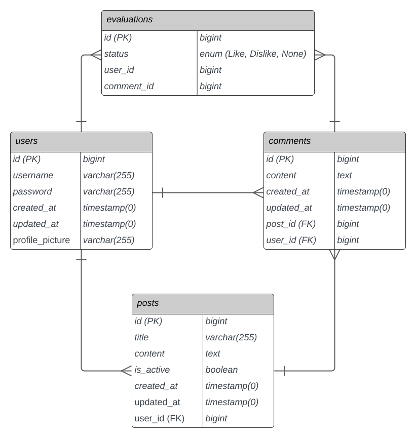

# Hush Hush API

API para o aplicativo Hush Hush desenvolvido para a disciplina de Programação Mobile 2023/1.
Ela é responsável por manipular as entidades referentes e Usuários, Postagens, Comentários e Avaliações.

## Autores
Elaine Dias Pires **2020101903**\
Filipe Gomes Arante de Souza **2020100625**

## Tecnologias Utilizadas
- PHP 8.1.23
- Laravel 10.28.0
- PostgreSQL 15

## Rodando API com Docker
Para rodar o backend, siga os seguintes passos:

1. Clonar este repositório localmente;
```
$ git clone <LINK_REPOSITÓRIO>
```
2. Acessar o diretório ``api``;

```
$ cd api
```
3. Executar o comando ``make`` presente no Makefile;

```
$ make
```

Prontinho! O backend já está em execução.

## Makefile

O Makefile desenvolvido possui comandos além do ``make``, que foi utilizado no tópico anterior. Confira abaixo:

1. Importar arquivos de configuração do ``vendor`` e geração do ``.env``. Deve ser executado antes de qualquer outro comando:
```
$ make install
```

2. Sobe os contêineres da API e do Banco de Dados.
```
$ make up
```

3. Derruba os contêineres da API e do Banco de Dados.
```
$ make down
```

4. Reseta e insere dados fictícios no Banco de Dados.
```
$ make seed
```

5. Executa os comandos 1, 2 e 4. Serve para quem quer apenas rodar a aplicação.
```
$ make
```

## Documentação com Swagger

Com a API rodando,  acesse a URL abaixo para ver detalhes dos endpoints implementados:

<a href="http://localhost:8000/docs">http://localhost:8000/docs </a>

## Tabelas do Banco de Dados
Foram criadas as tabelas User, Post, Comment e Evaluation. Segue abaixo diagrama ER com mais detalhes:

<div style="text-align: center;">
  
</div>
